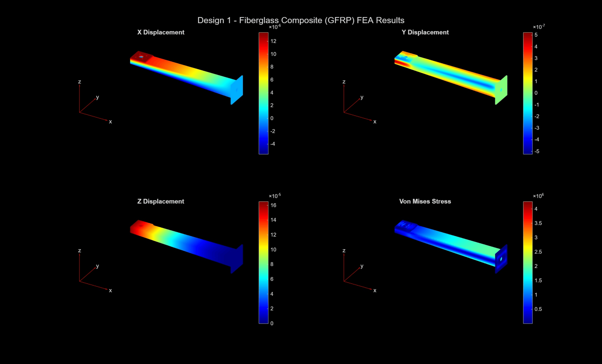

# Solution to Classroom Challenge Project — Drone Payload Capacity and Structural Design Analysis — Team 3

MATLAB-based UAV arm design and optimization project using CAD modeling, thrust-to-weight analysis, finite element analysis (FEA), and material cost optimization to evaluate structural performance and payload capacity.

This project was completed as part of the MathWorks Classroom Challenge and demonstrates the application of CAD modeling, MATLAB programming, thrust-to-weight analysis, and finite element analysis (FEA) to optimize UAV drone arm performance.

---

# Project Objective

The objective of this project is to design and evaluate a quadcopter drone arm that maximizes payload capacity while maintaining safe flight performance and structural integrity. Two distinct drone arm geometries were evaluated using six different engineering materials through thrust-to-weight analysis and Finite Element Analysis (FEA).

Through the development and analysis of these designs, the project investigates how geometry and material selection affect payload capacity, factor of safety, material cost, structural displacement, and stress distribution (e.g., Von Mises stress). Through analytical calculations and computational modeling, this project identifies the drone arm design that best provides effective payload capacity and structural integrity while optimizing material cost.

---

# MATLAB is used throughout this project to:

* Perform thrust-to-weight analysis
* Perform Finite Element Analysis (FEA)
* Perform material cost optimization

---

# Repository Structure

## CAD-Designs

Contains all CAD models and design sketches.

### Design-1-Hollow-Tapered-Rectangular-Tube

* Design_1_Concept_Sketch.pdf
* Design_1_CAD_Model.STEP
* Visualization_Only_Model.STL --- STL export for visual purposes only on GitHub

### Design-2-Hollow-Truss-Structure

* Design_2_Concept_Sketch.pdf
* Design_2_CAD_Model.STL

## Documentation

Contains supporting project documentation.

* Drone_Constraints_Assumptions_and_Design_Ideas.pdf
* Drone_Payload_Team_3_TOA.pdf

## MATLAB

Contains all MATLAB files used throughout the project.

* DroneDesign_Team3_Analysis.mlx --- Main MATLAB Live Script containing the complete drone design, analysis, and optimization workflow.

* droneArmMaterials.mat --- Material properties database used throughout the analysis.

* Live-Script-PDF-Exports

  * Design_1_Live_Script_Analysis_Export.pdf --- PDF export of the MATLAB analysis using Design 1.
  * Design_2_Live_Script_Analysis_Export.pdf --- PDF export of the MATLAB analysis using Design 2.

## Results

Contains all exported project results organized by drone design.

Each design folder contains:

* Maximum payload tables and charts
* Material cost optimization tables and charts
* FEA plots
* FEA result tables
* Face label reference files

An example of the exported FEA results is shown below for Design 1 using Fiberglass Composite (GFRP): 




---

# CAD Download Instructions

1. Open the **CAD-Designs** folder.
2. Open the **Design-1-Hollow-Tapered-Rectangular-Tube** or **Design-2-Hollow-Truss-Structure** folder
3. Select the desired STEP (For Design 1) or STL (For Design 2) file.
4. Click **Download Raw File** (download icon) in the upper-right corner.

   * Alternatively, right-click **Raw** and choose **Save Link As...**

---

# Project Solution Instructions

1. Open MATLAB.

2. Place all project files in the same working folder.

3. Open `DroneDesign_Team3_Analysis.mlx`.

4. Ensure the following files are located in the working directory:

* `droneArmMaterials.mat`
* `Design_1_CAD_Model.STEP`
* `Design_2_CAD_Model.STL`

5. Select which drone arm design you would like to analyze during **Task 4: Finite Element Analysis (FEA)**.

   To switch between the two drone arm designs, locate the design selection in the Live Script.

   **For Design 1:**

   ```matlab
   selectedDesign = "Design 1";
   % selectedDesign = "Design 2";
   ```

   **For Design 2:**

   ```matlab
   % selectedDesign = "Design 1";
   selectedDesign = "Design 2";
   ```

   Only one design should remain uncommented before running the script. Design 1 is selected by default, as it is the final recommended design for this project.

6. Click **Run**.

The Live Script automatically generates:

* Payload summary tables
* Maximum payload comparison charts
* Material cost comparison charts
* FEA displacement plots
* Von Mises stress plots
* FEA results tables
* Material cost optimization tables
* Final design recommendation

All exported figures, tables, and analysis outputs can be found in the **Results** folder, organized separately for Design 1 and Design 2.

---

# Project Workflow

## 1. Gather Assumptions and Load Material Properties

Defines the drone design assumptions, component masses, thrust capacity, and project constraints, then loads the material properties used throughout the analysis.

The analysis considers six materials:

* Carbon Fiber Composite (CFRP)
* Aluminum Alloy
* Fiberglass Composite (GFRP)
* PLA Plastic
* ABS Plastic
* Wood (Birch)

The project parameters include:

* Quadcopter configuration with four motors and four propellers
* Maximum thrust of **1 kg per motor**
* Base drone mass of **1 kg**, excluding arms and payload
* Minimum payload requirement of **0.5 kg**
* Minimum thrust-to-weight ratio of **2:1**
* Four drone arms

Material properties used in the analysis include density, Young's modulus, Poisson's ratio, yield strength, and average material cost.

## 2. Propose Two Drone Arm Designs

Develops and compares two distinct drone arm geometries through CAD models and design sketches.

**Design 1** is a tapered hollow rectangular tube designed to strategically reduce material toward the motor mount while maintaining greater structural reinforcement near the drone body connection.

**Design 2** is a hollow truss-shaped structure designed to reduce mass while providing additional structural reinforcement through internal truss members.

The two designs are evaluated based on their geometry, volume, structural behavior, and suitability for the required loading conditions.

## 3. Perform Thrust-to-Weight Analysis

Calculates the maximum payload capacity for each combination of drone arm design and material.

The analysis evaluates both arm geometries across all six material options and determines whether each combination satisfies:

* Minimum payload requirement of **0.5 kg**
* Minimum thrust-to-weight ratio of **2:1**

The results are presented using summary tables and payload comparison plots.

## 4. Perform Finite Element Analysis (FEA)

Performs a structural finite element analysis on a single drone arm for the selected design.

The model:

* Imports the corresponding CAD geometry into MATLAB
* Generates a finite element mesh
* Fixes the arm at the attachment point to the drone body
* Applies the upward motor thrust and downward motor weight to the motor mounting face
* Evaluates the arm using all six material options

The analysis calculates:

* Maximum displacement
* Maximum Von Mises stress
* Factor of Safety

The results are presented using numerical summary tables and displacement and Von Mises stress visualizations.

## 5. Optimize Material Cost

Uses the results from the thrust-to-weight analysis and FEA to identify material options that satisfy the required payload, thrust-to-weight ratio, and Factor of Safety requirements.

The total material cost is then calculated for each material option based on the arm geometry, material cost, and four-arm configuration. The valid material options are compared to identify the lowest-cost solution while considering structural performance and engineering practicality.

## 6. Recommend a Final Design Solution

Interprets the results from the thrust-to-weight analysis, FEA, and material cost optimization to select the final drone arm geometry and material.

The final recommendation considers quantitative performance, structural safety, material cost, manufacturability, and practical engineering limitations.

---

# Required Software

* MATLAB R2026a

---

# Required Toolboxes

* Partial Differential Equation Toolbox

---

# Final Recommendation

Based on the thrust-to-weight analysis, Finite Element Analysis (FEA), and material cost optimization, the recommended design is **Design 1, a tapered hollow rectangular arm** constructed from **Fiberglass Composite (GFRP)**. It provides the best balance of payload capacity, structural safety, and engineering performance while satisfying all project constraints.

Although Carbon Fiber Composite (CFRP) provided the highest overall structural performance, GFRP offered a better balance between performance and cost while still meeting all project requirements. The improvements provided by CFRP were relatively small compared to its increase in material cost, making GFRP the more practical engineering choice.

Additionally, while Wood (Birch) was identified as the lowest-cost material, it was not selected as the final recommendation. Although it satisfied the project requirements under the simplified loading conditions, it was not considered the best choice for real-world drone applications where additional engineering conditions such as wind, vibration, fatigue, and landing impacts must be considered. Furthermore, wood can absorb moisture from the environment, which may reduce structural performance over time while increasing the overall weight of the drone. For these reasons, GFRP was considered the strongest overall engineering solution.

Compared with Design 2, Design 1 demonstrated better structural behavior. Although Design 2 met the project requirements, it experienced greater maximum displacement. Through investigation, it was determined that the truss members primarily reinforced the x- and y-directions but provided limited resistance in the z-direction. This reduced the arm's resistance to vertical bending and likely contributed to the higher displacement. Rather than redesigning the arm, the team chose to retain the original design because it demonstrates the engineering design process. The results highlighted how analysis, testing, and iteration lead to improved engineering decisions and provide valuable lessons for future designs.

Overall, Design 1 with GFRP provided the best combination of payload capacity, structural integrity, manufacturability, and material cost. Future work could expand this analysis by incorporating wind loading, vibration, fatigue, landing impacts, motor torque, and experimental prototype testing to better represent real operating conditions.

A more detailed report of the final design recommendation, including the MATLAB-based analysis, FEA results, and optimization process, can be found in the accompanying MATLAB Live Script (DroneDesign_Team3_Analysis.mlx).
